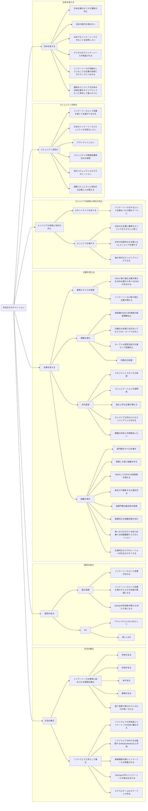

# jp-marketing

## 外向きのモチベーション

```mermaid

flowchart LR
  InnerSource(外向きのモチベーション)
  InnerSource --> CommunityVitalization
  InnerSource --> EstablishMethod
  InnerSource --> EngineerGrowth
  InnerSource --> TransformCompany
  InnerSource --> ChangeJapan
  InnerSource --> RecognitionExpansion

  subgraph 方法の確立
    EstablishMethod(方法の確立)
    EstablishMethod --> InnerSourceEnv[インナーソースを簡単に始められる環境の確立]
      InnerSourceEnv --> 学校がある
      InnerSourceEnv --> 科目がある
      InnerSourceEnv --> 本がある
      InnerSourceEnv --> 事例がある
      InnerSourceEnv --> 違う言葉で語られていたものが統一される
    EstablishMethod --> EsttablishSWEngineering[ソフトウェア工学として確立]
      EsttablishSWEngineering --> ソフトウェア工学体系にインナーソースを刻む/確立する
      EsttablishSWEngineering --> ソフトウェアの作り方を整理する/Mode1Mode2などが例
      EsttablishSWEngineering --> 事業開発の際にインナーソースが意識される
      EsttablishSWEngineering --> DevOpsの中にインナーソースが組み込まれる
      EsttablishSWEngineering --> スクラムチームのスケーリング手法
  end

  subgraph 認知の拡大
    RecognitionExpansion[認知の拡大]
      RecognitionExpansion --> Term[語の浸透]
        Term --> インナーソースという言葉が伝わる
        Term--> インナーソースという言葉を使わずともその状態が普通になる
        Term --> GitHubの利用者が増える/当たり前になる
      RecognitionExpansion --> DX
        DX --> アジャイルじゃないDXとして
        DX --> 新しいDX
  end

  subgraph 企業を変える
    TransformCompany[企業を変える]
      TransformCompany --> DevStyle[開発スタイルの変更]
        DevStyle --> OSSに取り組む企業が増える/日本企業から多くのOSSが生まれる
        DevStyle --> インナーソースに取り組む企業が増える
      TransformCompany --> ChangeInUnderstanding[理解の変化]
        ChangeInUnderstanding --> 経営層のSW人材/資産の価値理解向上
        ChangeInUnderstanding --> 内製化の本質に向き合ってもらう/ローコードではなく
        ChangeInUnderstanding --> オープンな意思決定が大事という認識向上
        ChangeInUnderstanding --> 内製化の促進
      TransformCompany --> CultureChange[文化変容]
        CultureChange --> マネジメントスタイルの変容
        CultureChange --> コミュニケーションの透明性
        CultureChange --> 協力上手な企業が増える
        CultureChange --> エンジニア以外の人にもエンジニアリング文化を
        CultureChange --> 課題の共有と共同解決したい
      TransformCompany --> OrganizationalChange[組織の変化]
        OrganizationalChange --> 部門間のサイロを壊す
        OrganizationalChange --> 風通しの良い組織を作る
        OrganizationalChange --> SWのことがわかる経営者が増える
        OrganizationalChange --> 総合力で勝負する土壌を作る
        OrganizationalChange --> 他部門間の集合知の実現
        OrganizationalChange --> 事業同士の相乗効果を生む
        OrganizationalChange --> 単一のプロダクトを持つ企業でも同業種間でコラボレーション
        OrganizationalChange --> 企業同士のコラボレーションが生まれやすくする
  end

  subgraph エンジニアの成長と地位の向上
    EngineerGrowth(エンジニアの成長と地位の向上)
      EngineerGrowth --> Spotlighting(スポットライトをあてる)
        Spotlighting --> インナーソースをやるという企業ないの人間をクールに
      EngineerGrowth --> MoreEngineers(エンジニアを増やす)
        MoreEngineers --> 日本の大企業に優秀なエンジニアが入りたいと思う
        MoreEngineers --> 日本の伝統的な大企業にもっとエンジニアを増やす
        MoreEngineers --> 後の世代がエンジニアリングできる
  end

  subgraph コミュニティ活性化
    CommunityVitalization(コミュニティ活性化)
      CommunityVitalization --> インナーソースという言葉を通して企業がつながる
      CommunityVitalization --> 日本のインナーソースコミュニティを活性化したい
      CommunityVitalization --> アウトプットしたい
      CommunityVitalization --> コミュニティの貢献度重視文化の実現
      CommunityVitalization --> 他のコミュニティとのコラボレーション
      CommunityVitalization --> 国際コミュニティに参加する企業と人が増える
  end

  subgraph 日本を変える
    ChangeJapan(日本を変える)
      ChangeJapan --> 日本企業のビジネス競争力向上
      ChangeJapan --> 日本の国力を高めたい
      ChangeJapan --> 日本でもインナーソースできることを証明したい
      ChangeJapan --> デジタル庁でインナーソースが推進される
      ChangeJapan --> インナーソースの活動をしていることが企業の採用にポジティブにつながる
      ChangeJapan --> 優秀なエンジニアが日本の伝統企業をキャリアとしてもっと率先して選ぶように
  end
```
