# 2022/08/23 #jp-marketing Kickoff Agenda

## 主な内容

- Agenda
- InnerSource Commons Japan ロードマップ
- InnerSource Commons Discussion フォーラム
- 議事録

## 詳細 Agenda (120m + 30m バッファ)

- #jp-marketing と ISC Japan について **(10m)**
  - InnerSource Commons を立ち上げた経緯と、これまでについて @yuhattor から共有 **- (5m)**
  - #jp-marketing について。#marketing の趣旨含め @yuhattor から共有 **- (5m)**
- ディスカッション / ブレスト / ラウンドテーブル **(80m - 途中休憩)**
  - `ラウンドテーブル` 個々の共有 **(10m)**
    - それぞれ 2m 程度ずつ
      - InnerSource Commons 参加のモチベーション
      - インナーソースとの関わり (間接的でも!)
      - 何をやりたいとおもったか
      - どのように参画したいか (*Optional)
  - `ブレインストーミング` InnerSource Commons を通して実現したいこと **(30m)**
    - 3つのテーマに関するブレスト 10m x 3
      - InnerSource Commons を通して、インパクトを与えたいことはなにか (外向きの理由) - (10m)
        - どのように(how)、何をしたい(what)、など、手段でも目的でも内容問いません。
          - InnerSource Commons を通して、得たいことはなにか (内向きの理由) - (10m)
          - キャリアとして、企業として、個人として得たいことを何かありますか。
            どんなものでも構いません。「楽しみたい」だけでももちろんOK
          - その上で、InnerSource Commons の活動で大事にしたいこと (as a group) - (10m)
    - 休憩 - **(10m)**
    - `ホワイトボーディング / ディスカッション` InnerSource Commons **(30m)**
      - まとまったポストイットを張り出してまとめていきます
      - 上記をもとにディスカッションしましょう
- **今後やっていくことのロードマップ整理 - (30m)**
  - **ミートアップの内容 Update (割り振りと依頼)** - (**15m)**
    - ミートアップのコンテンツと開催方法
      当面は Meetup の開催と、コンテンツ拡充が大きなタスクになってくると思います。定期的なアクティビティ として、どのように少ない労力で最大のインパクトを出すのか考えましょう。定期的なアクティビティは疲れたらそこでおしまいなので… 

  - その他のコンテンツでやりたいこと **(10m)**
    - ホワイトボードディスカッションをもとに
      - 翻訳プロジェクト
      - ブログ
      - Qiita アドベントカレンダーなど
  - **Big Event とマイルストン** - **(5m)**
    - Big Events 候補
      2023: InnerSource Commons Japan 1 Year Anniversary イベントの開催 (拡大版)
      2024: InnerSource Gathering Tokyo を 2024年に開催したい (外タレ誘致)
      2024: 経産省のレポートにインナーソースを掲載
            [追加お待ちしてます！]

- 活動に関して (残り/バッファ - 30m )
  - なにかフィードバックあれば - 飲み会の席でも OK
  - その他

## **後半戦**

- **ISC Japan の盛り上げと、ISC Japan における役割と居場所** - **(後半戦: 居酒屋ですかね)**
  - Contents
    ISC の活動は誰でも始められますし、どんな活動にも Pull Request やIssue、広報、登壇などで貢献できます。また　ISC はオープンソースの活動であり、基本的に役割が誰かに独占されることはありません。しかし「なんでもやって良い」と言われると何をやったら良いのかわからなくなるものだとおもいます。また Trusted Committer など、プロジェクトにおけるインナーソースの役割はあるものの、コミュニティ活動全般においては役割が非常に曖昧になります。

    せっかく、ISC Japan に参画してもらっても、オンボーディングをきちんとして、役割をうまく感じてもらわないと何をやって良いのかわからないと思います。
    そのためには、どんどん権限を移譲していく必要があります。ある意味で、ISC における権限は GitHub のリポジトリにおける権限などを除いて、最初からあってないようなものです。ここでいう**権限**は、「やっても良いんだ！」「イニシアチブを取れる！」「これは俺が、私が推進している！」「ここについては私は活動の一部に慣れている！」という感覚を持って参加してもらうという意味です。そのためにオープンで、フラットで、他者を尊敬しつつ、自分が自由に遊べるコミュニティを作る必要があります。
    どのようにコミュニティを盛り上げていけるのか、そしてどのように役割を感じてもらえるのかのディスカッションがしたいです。
    参加していただいているみなさまは、兼ねてから InnerSource Commons でアクティブに活躍されている方ですので、他の方が参加するにはどうしたら良いのかなど、一緒に考えていただけると…!

    - Learning Path の貢献者 + ISC の古参メンバーで、実質的に一緒に立ち上げをやらせていただいている小林さん
    - jp-contents を一緒にリードしてくださっている Mass さん (jp-contents TC)
    - jp-event (予定)を一緒にリードしてくれる Shoma さん (Community Leader)
    - InnerSource の紐時と Promotion や戦略に貢献してくださっている Uiko さん
    - 高いクオリティで Contents にコントリビュートしてくださっている amixedcolor さん

## InnerSource Commons Japan ロードマップ

アクティビティのたたき台を作りました

[InnerSource Commons Japan Roadmap * InnerSourceCommons](https://github.com/orgs/InnerSourceCommons/projects/1)

リポジトリはこちら。具体的な README があります。

[https://github.com/InnerSourceCommons/jp-roadmap](https://github.com/InnerSourceCommons/jp-roadmap)

## InnerSource Commons Discussion フォーラム

今後、話が膨らんでいった時にまとめられるフォーラムを作りました

[https://github.com/InnerSourceCommons/jp-roadmap/discussions](https://github.com/InnerSourceCommons/jp-roadmap/discussions)

今はこぢんまりしているので Slack で良いと思いますが、Slack だと流れてしまうので、ロードマップに入る前のプロジェクトなどを管理するための場所として設定しています。

GH Discussion が今の形になったのはつい最近ですし、今後また使い方のプラクティスなどはこなれていくと思いますが… 実験的にやっています。

## ディスカッション結果

### 外向きのモチベーション

```mermaid

flowchart LR
  InnerSource(外向きのモチベーション)
  InnerSource --> CommunityVitalization
  InnerSource --> EstablishMethod
  InnerSource --> EngineerGrowth
  InnerSource --> TransformCompany
  InnerSource --> ChangeJapan
  InnerSource --> RecognitionExpansion

  subgraph 方法の確立
    EstablishMethod(方法の確立)
    EstablishMethod --> InnerSourceEnv[インナーソースを簡単に始められる環境の確立]
      InnerSourceEnv --> 学校がある
      InnerSourceEnv --> 科目がある
      InnerSourceEnv --> 本がある
      InnerSourceEnv --> 事例がある
      InnerSourceEnv --> 違う言葉で語られていたものが統一される
    EstablishMethod --> EsttablishSWEngineering[ソフトウェア工学として確立]
      EsttablishSWEngineering --> ソフトウェア工学体系にインナーソースを刻む/確立する
      EsttablishSWEngineering --> ソフトウェアの作り方を整理する/Mode1Mode2などが例
      EsttablishSWEngineering --> 事業開発の際にインナーソースが意識される
      EsttablishSWEngineering --> DevOpsの中にインナーソースが組み込まれる
      EsttablishSWEngineering --> スクラムチームのスケーリング手法
  end

  subgraph 認知の拡大
    RecognitionExpansion[認知の拡大]
      RecognitionExpansion --> Term[語の浸透]
        Term --> インナーソースという言葉が伝わる
        Term--> インナーソースという言葉を使わずともその状態が普通になる
        Term --> GitHubの利用者が増える/当たり前になる
      RecognitionExpansion --> DX
        DX --> アジャイルじゃないDXとして
        DX --> 新しいDX
  end

  subgraph 企業を変える
    TransformCompany[企業を変える]
      TransformCompany --> DevStyle[開発スタイルの変更]
        DevStyle --> OSSに取り組む企業が増える/日本企業から多くのOSSが生まれる
        DevStyle --> インナーソースに取り組む企業が増える
      TransformCompany --> ChangeInUnderstanding[理解の変化]
        ChangeInUnderstanding --> 経営層のSW人材/資産の価値理解向上
        ChangeInUnderstanding --> 内製化の本質に向き合ってもらう/ローコードではなく
        ChangeInUnderstanding --> オープンな意思決定が大事という認識向上
        ChangeInUnderstanding --> 内製化の促進
      TransformCompany --> CultureChange[文化変容]
        CultureChange --> マネジメントスタイルの変容
        CultureChange --> コミュニケーションの透明性
        CultureChange --> 協力上手な企業が増える
        CultureChange --> エンジニア以外の人にもエンジニアリング文化を
        CultureChange --> 課題の共有と共同解決したい
      TransformCompany --> OrganizationalChange[組織の変化]
        OrganizationalChange --> 部門間のサイロを壊す
        OrganizationalChange --> 風通しの良い組織を作る
        OrganizationalChange --> SWのことがわかる経営者が増える
        OrganizationalChange --> 総合力で勝負する土壌を作る
        OrganizationalChange --> 他部門間の集合知の実現
        OrganizationalChange --> 事業同士の相乗効果を生む
        OrganizationalChange --> 単一のプロダクトを持つ企業でも同業種間でコラボレーション
        OrganizationalChange --> 企業同士のコラボレーションが生まれやすくする
  end

  subgraph エンジニアの成長と地位の向上
    EngineerGrowth(エンジニアの成長と地位の向上)
      EngineerGrowth --> Spotlighting(スポットライトをあてる)
        Spotlighting --> インナーソースをやるという企業ないの人間をクールに
      EngineerGrowth --> MoreEngineers(エンジニアを増やす)
        MoreEngineers --> 日本の大企業に優秀なエンジニアが入りたいと思う
        MoreEngineers --> 日本の伝統的な大企業にもっとエンジニアを増やす
        MoreEngineers --> 後の世代がエンジニアリングできる
  end

  subgraph コミュニティ活性化
    CommunityVitalization(コミュニティ活性化)
      CommunityVitalization --> インナーソースという言葉を通して企業がつながる
      CommunityVitalization --> 日本のインナーソースコミュニティを活性化したい
      CommunityVitalization --> アウトプットしたい
      CommunityVitalization --> コミュニティの貢献度重視文化の実現
      CommunityVitalization --> 他のコミュニティとのコラボレーション
      CommunityVitalization --> 国際コミュニティに参加する企業と人が増える
  end

  subgraph 日本を変える
    ChangeJapan(日本を変える)
      ChangeJapan --> 日本企業のビジネス競争力向上
      ChangeJapan --> 日本の国力を高めたい
      ChangeJapan --> 日本でもインナーソースできることを証明したい
      ChangeJapan --> デジタル庁でインナーソースが推進される
      ChangeJapan --> インナーソースの活動をしていることが企業の採用にポジティブにつながる
      ChangeJapan --> 優秀なエンジニアが日本の伝統企業をキャリアとしてもっと率先して選ぶように
  end
```

### 内向きのモチベーション

```mermaid
flowchart LR
  InnerSource(内向きのモチベーション)
  InnerSource --> law
  InnerSource --> ChangeOrg
  InnerSource --> Want 
  InnerSource --> GitHub 
  InnerSource --> Community 
  InnerSource --> Connection 
  InnerSource --> Career
  InnerSource --> International
  InnerSource --> InnerSourcePractice
  InnerSource --> Contribution
  InnerSource --> Important
  InnerSource --> ChangeJapan

  subgraph 法律
    law --> 課税と輸出管理を楽にする
    law --> 会社と税務の考え方のコンセンサスを得る
    law --> 企業グループでやっても大丈夫だという同士を作る
    law --> 資産移転の共通の考え方を作る
    law --> SWは資産にしなくていいとなったらいいな
  end

  subgraph 組織を変える
    ChangeOrg --> あっちで同じことしてたをなくす
    ChangeOrg --> 社内のコラボと言わなくても良い状況にする
    ChangeOrg --> 協働する文化に会社を変える
    ChangeOrg --> うちの会社も買われるんだというマインド
    ChangeOrg --> 今の会社をIT業界で生き残らせる
    ChangeOrg --> 社内を社外から変える
    ChangeOrg --> 社内と社外とのコラボレーションを増やす
    ChangeOrg --> 会社としてイノベーションをリードして
  end

  subgraph したい
    Want --> わいわいしたい
    Want --> 楽しみたい
    Want --> 波に乗る
    Want --> 大義の一部になるのは楽しい
    Want --> チャレンジしたい
    Want --> 自分にできることはなんでもやりたい
    Want --> 楽しみたい
    Want --> インナーソースコミュニティはGiveの精神があってよいなあ
    Want --> インナーソースコモンズに日本のインパクトを出す
    Want --> UpstreamFirst
  end

  subgraph Tooling
    GitHub --> GHをたくさん使う
    GitHub --> GHをもっと使って欲しい
  end

  subgraph コミュニティ
    Community --> コミュニティ立ち上げのノウハウを知りたい
    Community --> コミュニティ運営のスキル
    Community --> 活動を広げる経験をしたい
    Community --> 人の繋がりを増やす場を作る
    Community --> コミュニティって面白い
    Community --> ちゃんと理解しながら進めたい
    Community --> 色々な経験がしたい
    Community --> 新しい知見を得たい
    Community --> 新しい考え方を知りたい
    Community --> 周りをもっと巻き込みたい
  end

  subgraph コネクション
    Connection --> 周りをもっと巻き込みたい
    Connection --> コミュニティ街でも仲良くなりたい
    Connection --> いろんな人と繋がりたい
    Connection --> 経営者とのつながり
    Connection --> 同志師匠弟子
  end

  subgraph キャリア
    Career --> 社長になる
    Career --> MSMVP
    Career --> キャリアに役立てたい
    Career --> 翻訳の実績を得たい
    Career --> 著作翻訳をやりたい
    Career --> 収入と仕事
    Career --> 企業に呼ばれる/講演/コンサル
    Career --> インナーソースで講演したい
  end

  subgraph 国際
    International --> インナーソースがグローバルコミュニティの入り口に
    International --> 日本のDeveloperがすごいと知らしめたい
    International --> 国際交流能力
    International --> 英語力
    International --> グローバルコミュニティは楽しい
  end

  subgraph インナーソースの理解
    InnerSourcePractice --> インナーソースを理解したい
    InnerSourcePractice --> インナーソースについて詳しくなりたい
    InnerSourcePractice --> インナーソースを実践したい
  end

  subgraph 貢献
    Contribution --> エンジニアに貢献したい
    Contribution --> 波を作る手助けをする
    Contribution --> 大きなアクティビティの縁の下の力持ちになる
    Contribution --> インナーソースという言葉用語によって人生が変わる人が増えて欲しい 
  end

  subgraph 大切にしたいこと
    Important --> 無理のない範囲でやっていきたい
    Important --> 心理的安全性を大切にしたい
    Important --> 誰かに負担がかからないようにしたい
    Important --> 思い立ったらすぐ実行
    Important --> トライとエラーを繰り返したい
    Important --> ループサイクルを早く回したい
    Important --> とりあえず動くことを大事にしたい
    Important --> 一人でやらずに協力したい
    Important --> 透明性のあるコミュニケーションスタイル
    Important --> それぞれの価値観を尊重したい
  end

  subgraph 日本を変える
    ChangeJapan --> 日本の将来をなんとかしたい
    ChangeJapan --> Leanを生み出した日本だからこそインナーソースで変革できる
    ChangeJapan --> 子供にもっとワクワクする世界を見せたい
    ChangeJapan --> SWが世界を変えることを信じているので正しいことを証明したい
    ChangeJapan --> 色々な組織が変わっていくのをみたい
    ChangeJapan --> 日本のインダス取りに貢献したい
    ChangeJapan --> インナーソースをやっている人をライトアップしたい
  end
    
```

