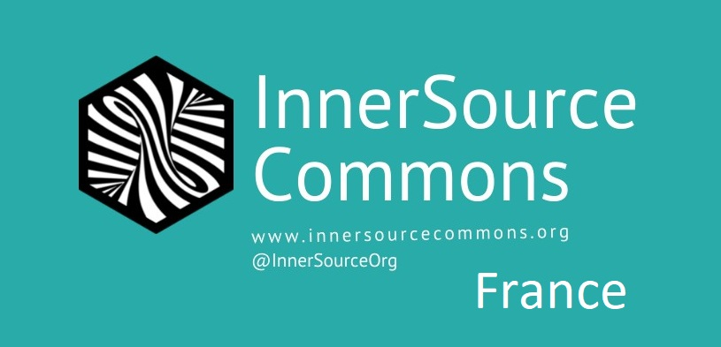

InnerSource Commons France Community
  
Welcome to the French community ! This is where you can learn about what project we're working on, what stage they're in, and when we expect to bring them to you.

**InnerSource France [Online Discussions Slack channel](https://innersourcecommons.slack.com/archives/C04HJ3KPR19)**

Notre communauté a pour vocation à réunir les praticiciens ou les curieux de l'Inner Source francophones pour partager nos expériences et contribuer à la communauté Inner Source Commons.

Tout est à construire dans notre communauté française, voilà tout de même les premières actions en cours de mise en place :
- Traduire le site d'Inner Source Commons et les Inner Source patterns : le site a déjà une version Française qui a été crée par nos premiers contributeurs, voir https://innersourcecommons.org/fr/
- Organiser des évènements et des sessions de partage en Français

Rejoignez-nous dans le [Canal Slack](https://innersourcecommons.slack.com/archives/C04HJ3KPR19) !

